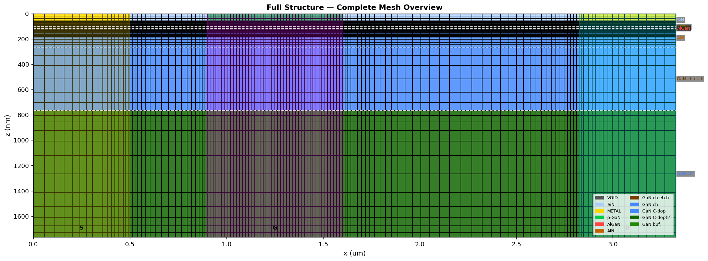

{width=100% fig-align="center"}

## About This Project

이 프로젝트는 p-GaN/AlGaN/AlN/GaN HEMT 내부에서 전자와
정공이 이동하고 산란하는 과정을 계산하기 위한 시뮬레이터를
개발하는 프로젝트입니다.

Python과 Jupyter Notebook을 기반으로 Ensemble Monte Carlo
방법과 Poisson 방정식을 결합하여 소자 내부의 캐리어 수송,
전위, 전기장, 전류 및 온도 변화를 계산합니다.

이 홈페이지에는 시뮬레이터를 개발하면서 공부한 물리 이론,
계산 방법, 검증 과정, 시뮬레이션 결과와 성능 개선 과정을
기록합니다.

## Main Topics

### Device Structure

p-GaN/AlGaN/AlN/GaN HEMT의 소자 구조와 물질, 도핑 및
계산 영역을 모델링합니다.

### Carrier Transport

전자와 정공을 슈퍼입자로 표현하고 자유비행과 산란 과정을
반복하여 캐리어의 이동을 계산합니다.

### Self-Consistent Electric Field

캐리어 분포로부터 전하 밀도를 계산하고 Poisson 방정식을 풀어
전위와 전기장을 갱신합니다.

### Scattering Physics

Acoustic phonon, polar optical phonon, piezoelectric,
impurity 및 alloy scattering 등을 고려합니다.

### Thermal Effects

평균 전류와 열저항을 이용하여 소자의 온도 변화를 계산하고,
온도가 캐리어 수송에 미치는 영향을 살펴봅니다.

### Validation and Optimization

계산 결과의 물리적 타당성을 점검하고 Python 및 Numba를
이용하여 계산 성능을 개선합니다.

## Current Status

::: {.callout-note}
현재 시뮬레이터는 연구 및 학습을 위한 개발 단계에 있습니다.

기본적인 캐리어 수송, 산란, Poisson 계산 및 준정적
self-heating 모델이 구현되어 있으며, 여러 전압과 온도
조건에서 계산 결과를 검토하고 있습니다.
:::

일부 결과에서는 기대되는 물리적 경향이 나타나고 있지만,
정량적인 정확성과 모델의 적용 범위에 대해서는 지속적인
검증이 필요합니다.

## About This Website

이 사이트에는 물리 모델과 계산 방법, 선별된 결과 및 개발
과정을 공개합니다. 전체 소스 코드와 원본 시뮬레이션 데이터는
현재 공개하지 않습니다.