```{=html}
<nav aria-label="Results 목차"><p><a href="#baseline">기본 구조</a> · <a href="#lg">Gate length (Lg)</a> · <a href="#lsg">Source-to-gate distance (Lsg)</a> · <a href="#lgd">Gate-to-drain distance (Lgd)</a> · <a href="#temperature">Substrate temperature</a> · <a href="#rth">Thermal resistance</a></p></nav>
<section id="conditions"><h2>공통 계산 조건</h2><p>구조 및 열 조건을 한 변수씩 변경한 전류 특성입니다. 별도 표기한 비교 변수를 제외하면 아래 기본 조건을 적용합니다.</p><figure class="figure" style="display:block;margin:1.5rem 0"><a href="images/results/baseline-structure.png">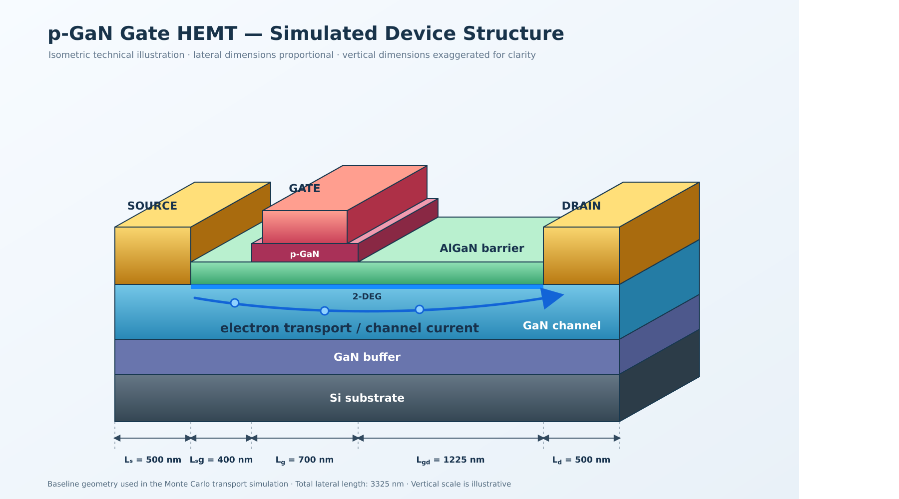</a><figcaption class="figure-caption">기본 소자 구조. 수직 방향은 층 구분을 위한 개념도이며, 기준 치수와 계산 조건은 아래 표에 정리했습니다. 그림을 누르면 원본 크기로 볼 수 있습니다.</figcaption></figure><div style="overflow-x:auto"><table class="table"><thead><tr><th>항목</th><th>조건</th></tr></thead><tbody><tr><td>계산 날짜</td><td>2026-09-15</td></tr><tr><td>기준 구조</td><td>Ls 500 / Lsg 400 / Lg 700 / Lgd 1225 / Ld 500 nm</td></tr><tr><td>기본 Tsub</td><td>300 K</td></tr><tr><td>기본 Rth</td><td>20 K·mm/W</td></tr><tr><td>Self-heating</td><td>ON — 준정적 열 모델</td></tr><tr><td>슈퍼입자 수</td><td>100,000</td></tr><tr><td>시간 간격</td><td>1 fs (1 × 10⁻¹⁵ s)</td></tr><tr><td>전압 조건별 steps</td><td>20,000</td></tr><tr><td>전류 평균</td><td>각 전압 조건의 마지막 10,000 steps</td></tr></tbody></table></div><p>열 모델: T<sub>device</sub> = T<sub>sub</sub> + R<sub>th</sub> V<sub>DS</sub> I<sub>DS</sub> (I<sub>DS</sub>: A/mm). 그래프의 전류 단위는 mA/mm입니다.</p><p>준정적 온도 갱신과 입자 수송 시간은 구분합니다. 현재 그림에는 통계적 오차막대를 표시하지 않았으며, 문턱전압·DIBL의 정량 추출은 포함하지 않습니다.</p></section>
<section id="baseline" style="scroll-margin-top:90px"><h2>1. 기본 구조</h2><p>Ls = 500 nm, Lsg = 400 nm, Lg = 700 nm, Lgd = 1225 nm, Ld = 500 nm.</p>
<figure class="figure" style="display:block;margin:1.5rem 0"><a href="images/results/baseline-transfer.png">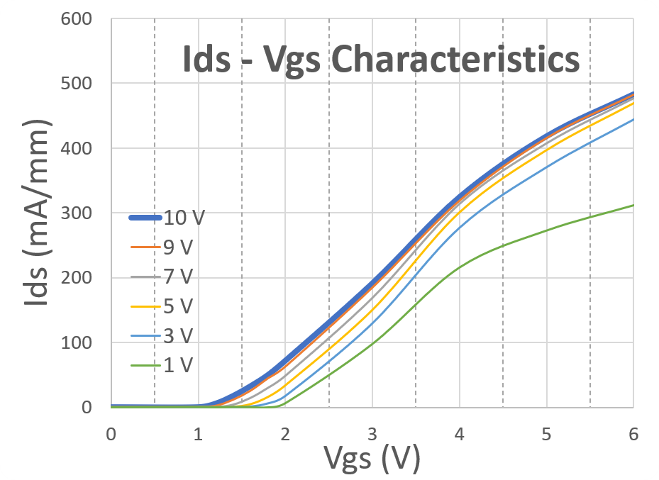</a><figcaption class="figure-caption">Figure 1. 기본 구조 — Ids–Vgs, Vds = 1, 3, 5, 7, 9, 10 V.</figcaption></figure>
<figure class="figure" style="display:block;margin:1.5rem 0"><a href="images/results/baseline-output.png">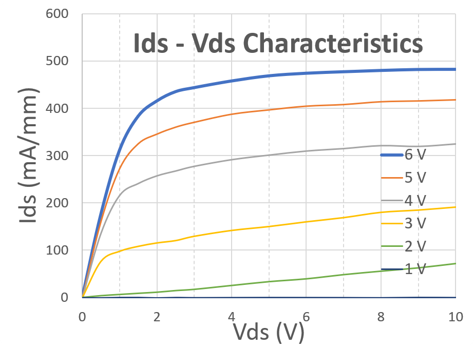</a><figcaption class="figure-caption">Figure 2. 기본 구조 — Ids–Vds, Vgs = 1–6 V.</figcaption></figure>
<section id="baseline-temperature" style="scroll-margin-top:90px"><h3>Self-heating에 따른 소자 온도</h3><figure class="figure" style="display:block;margin:1.5rem 0"><a href="images/results/baseline-temperature.png">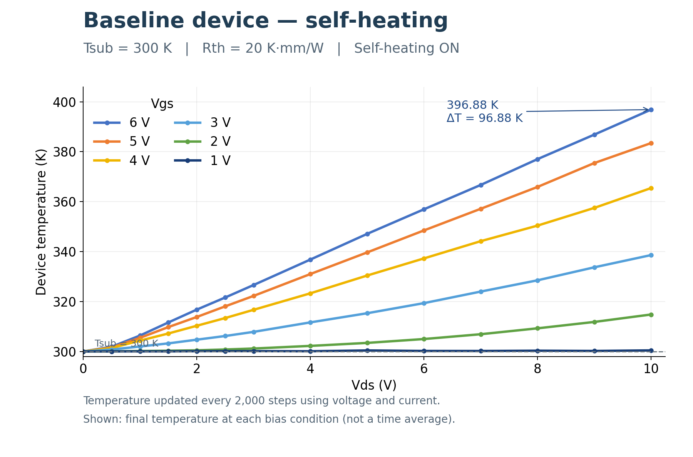</a><figcaption class="figure-caption">기본 구조의 self-heating에 따른 소자 온도. Tsub = 300 K, Rth = 20 K·mm/W, self-heating ON. 각 전압 조건에서 전류와 전압에 따라 2,000 step마다 온도를 갱신했으며, 마지막 수렴 상태의 최종 온도를 표시했습니다. 점은 계산값이고 선은 점을 연결한 것입니다.</figcaption></figure><p>Vgs = 6 V, Vds = 10 V에서 최종 소자 온도는 <strong>396.88 K</strong>이며, 기판 온도 대비 상승량은 <strong>96.88 K</strong>입니다. 이 값은 시간 평균 온도가 아니라 온도 갱신의 최종값입니다.</p></section>
<p><strong>관찰 및 해석 범위.</strong> 이후 비교의 기준 구조입니다. Vgs 증가에 따라 전류가 증가하고, 높은 Vgs의 출력 특성에서는 Vds 증가에 따른 전류 증가폭이 줄어듭니다.</p></section>
<section id="baseline-low-current" style="scroll-margin-top:90px"><h3>Turn-on 부근 저전류의 장시간 평균 검토</h3><p>Vgs = 1 V, Vds = 10 V에서 full 영역 전류(<code>I_hist</code>)의 평균 특성을 검토했습니다. 초기 60,000 step을 제외하고, 난수 seed를 변경하지 않은 연속 계산의 14개 기록을 순서대로 연결했습니다. 각 기록은 20,000 step이며, 분석 구간은 총 280,000 step(시간 간격 1 fs 기준 280 ps)입니다. 각 파일의 앞부분을 다시 제외하지 않고 전체 기록을 사용했습니다.</p><figure class="figure" style="display:block;margin:1.5rem 0"><a href="images/results/baseline-low-current.png">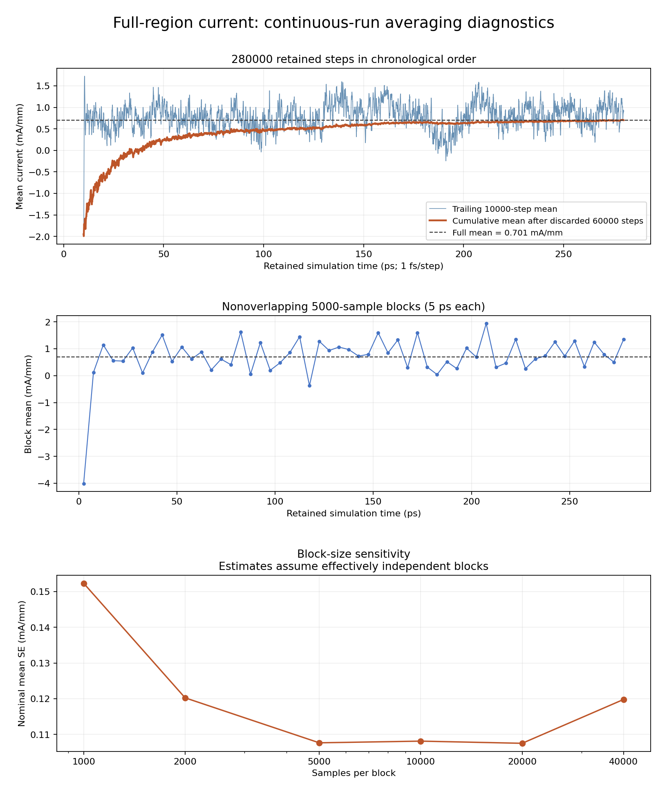</a><figcaption class="figure-caption">위: 파란선은 직전 10,000 sample의 이동평균, 붉은선은 분석 시작부터 해당 시점까지의 누적 평균입니다. 두 곡선은 10,000번째 sample부터 표시하므로 붉은선의 첫 점은 첫 10,000 sample의 평균입니다. 가운데: 겹치지 않는 5,000 sample(5 ps) 블록의 평균. 아래: 블록 길이에 따른 전체 평균의 표준오차 추정값.</figcaption></figure><p><strong>결과.</strong> 순간 전류의 표본 표준편차는 <strong>12.13 mA/mm</strong>이지만, 전체 시간 평균은 <strong>0.701 mA/mm</strong>입니다. 순간 변동 폭과 평균값의 통계적 오차는 구분합니다. 블록당 5,000 sample을 사용하면 56개 블록이 되며, 블록 평균 사이의 상관이 충분히 작다는 가정에서 전체 평균의 표준오차 추정값은 약 <strong>0.108 mA/mm</strong>입니다. 블록 길이를 10,000 또는 20,000 sample로 바꿔도 추정값은 약 0.108 mA/mm로 비슷합니다.</p><p><strong>해석.</strong> 충분히 안정된 상태에서는 긴 시간 평균으로 평균 전류의 통계적 오차를 줄일 수 있습니다. 이동평균은 시간에 따른 평균의 변화를 보여주며, 통계적 오차 검토에는 겹치지 않는 블록 평균을 사용했습니다. 서로 다른 난수를 사용하더라도 입자·전위 상태가 이어지므로 연속 구간의 독립성을 자동으로 가정하지 않습니다. 블록 길이에 따른 추정값의 안정성은 유용한 점검이지만 독립성이나 수렴의 완전한 증명은 아닙니다.</p><p><strong>남은 점검.</strong> 첫 5,000 sample의 평균은 약 −4 mA/mm이고, 첫 10,000 sample의 평균은 약 −1.94 mA/mm입니다. 음의 평균 전류가 나타난 원인은 전류 기록만으로 확인되지 않았으며, 해당 구간을 임의로 제외하지 않았습니다. 모델·격자·입자 수에 따른 오차는 이 통계 추정에 포함하지 않습니다. 이번 자료는 한 전압 조건의 저전류 평균을 검토한 결과로, 촘촘한 Ids–Vgs 곡선이나 문턱전압의 정량 추출을 대신하지 않습니다.</p></section>
<section id="baseline-current-history" style="scroll-margin-top:90px"><h3>전류의 시간 변화와 평균 구간</h3><p>기본 구조, Vgs = 6 V, Vds = 10 V에서 full 영역 전류(<code>I_hist</code>)의 20,000 step 기록입니다. 이 보충 자료의 파일 내부 계산 날짜는 <strong>2026-08-03</strong>입니다.</p><figure class="figure" style="display:block;margin:1.5rem 0"><a href="images/results/baseline-current-history.png">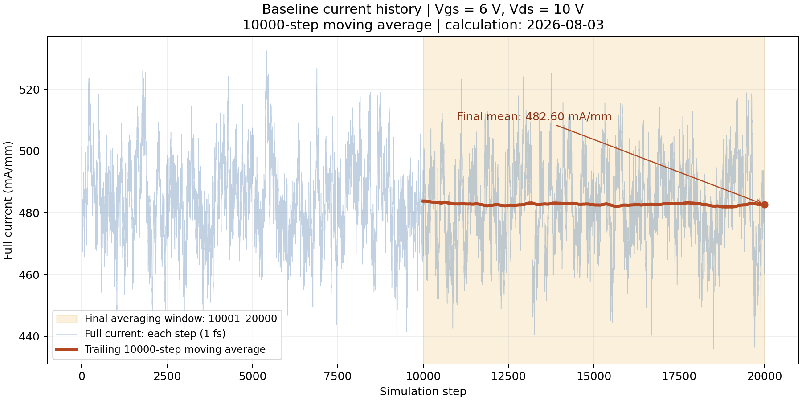</a><figcaption class="figure-caption">기본 구조 전류 기록. 옅은 선: 1 fs 간격 순간 전류. 굵은 선: 현재 step을 포함한 직전 10,000 step의 이동평균. 배경: 최종 전류 평균 구간.</figcaption></figure><p>이동평균은 10,000번째 step부터 표시합니다. 마지막 값은 10,001–20,000 step의 산술평균인 <strong>482.60 mA/mm</strong>입니다. 해당 구간의 순간 전류 표본 표준편차는 <strong>13.76 mA/mm</strong>이며, 평균값의 표준오차와는 구분합니다. 겹치는 이동평균 값은 독립 표본이 아니므로 곡선의 매끄러움만으로 평균의 오차를 판단하지 않습니다.</p><p>평균 구간의 앞·뒤 5,000 step 평균은 482.10, 483.10 mA/mm로 약 0.21% 차이입니다. 이 기록은 이미 약 396 K인 상태에서 시작하며, 초기 상태부터의 전체 수렴 과정을 보여주지는 않습니다.</p></section>
<section id="baseline-channel-profiles" style="scroll-margin-top:90px"><h3>채널 방향 전위·전기장·전자 밀도</h3><p>기본 구조에서 Vgs = 6 V, Vds = 1, 3, 10 V의 최종 저장 상태를 비교했습니다. 채널 상단 z = 116 nm 바로 아래의 동일 셀(중심 z ≈ 116.42 nm, 셀 범위 116–116.83 nm)에서 추출했습니다.</p><figure class="figure" style="display:block;margin:1.5rem 0"><a href="images/results/baseline-channel-profiles.png">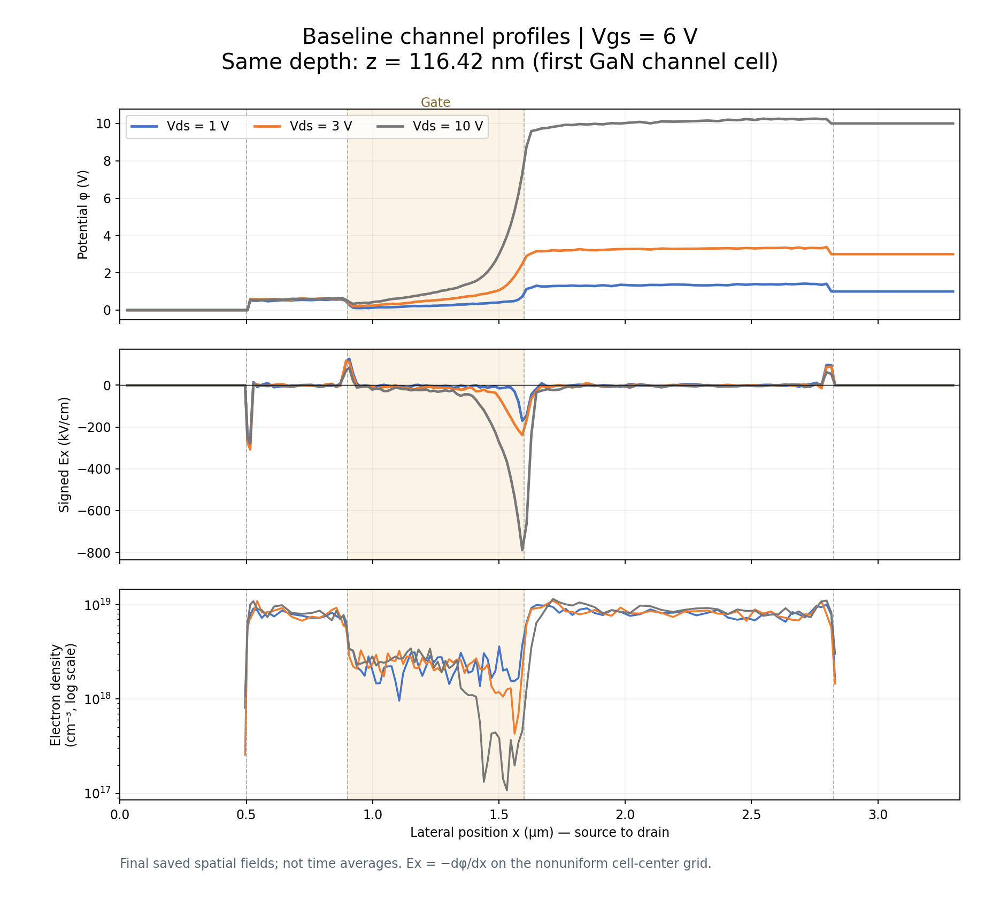</a><figcaption class="figure-caption">위부터 전위 φ, 수평 전기장 Ex, 로그축 전자 밀도 n입니다. 노란 영역은 gate(x = 0.9–1.6 µm)입니다. Ex = −∂φ/∂x는 비균일 격자의 셀 중심 좌표를 사용해 계산했으며, 평활화는 적용하지 않았습니다. 로그축에서 밀도가 0인 셀은 표시하지 않았습니다.</figcaption></figure><p><strong>관찰.</strong> Vds가 증가할수록 gate의 drain 쪽 끝 부근에서 전위 변화와 수평 전기장의 집중이 커집니다. Vds = 10 V에서는 같은 깊이의 gate drain 쪽 전자 밀도가 감소하며, 출력 특성의 포화와 pinch-off 해석을 검토할 자료가 됩니다.</p><p><strong>해석 범위.</strong> 이 그림은 시간 평균이 아닌 최종 상태의 단면이며, 입자 통계에 따른 공간 요동이 남아 있습니다. 전자 밀도는 국소 체적 밀도(cm⁻³)로, 2DEG 면밀도와 구분합니다. 단일 깊이의 밀도 감소만으로 pinch-off를 확정하지 않습니다. Self-heating이 적용되어 최종 갱신 온도는 Vds = 1, 3, 10 V에서 각각 306.37, 326.61, 396.88 K이며, 전압과 온도의 변화가 함께 포함됩니다. 접촉 및 gate 경계의 전기장 값은 격자와 미분 방법의 영향도 고려해야 합니다.</p></section>
<section id="lg" style="scroll-margin-top:90px"><h2>2. Gate length (Lg)</h2><p>Lg = 300, 500, 700 nm. 나머지 구조 치수는 기본값입니다.</p>
<figure class="figure" style="display:block;margin:1.5rem 0"><a href="images/results/lg-transfer.png">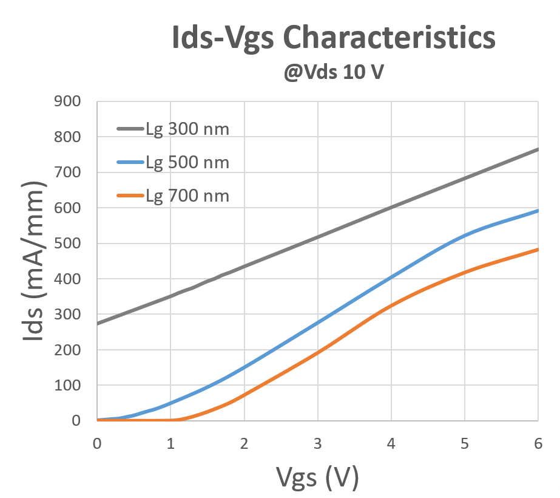</a><figcaption class="figure-caption">Figure 3. Gate length (Lg) — Ids–Vgs, Vds = 10 V.</figcaption></figure>
<figure class="figure" style="display:block;margin:1.5rem 0"><a href="images/results/lg-output.png">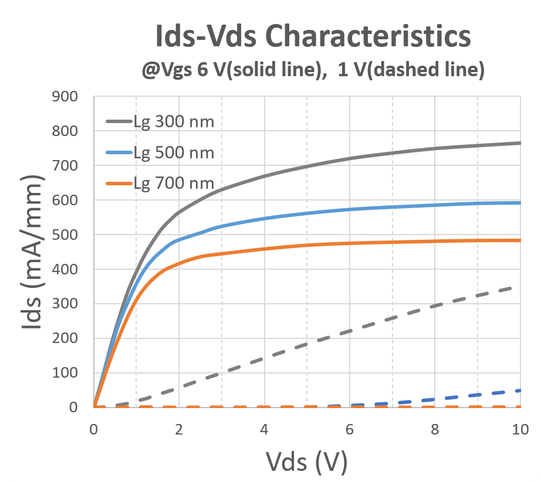</a><figcaption class="figure-caption">Figure 4. Gate length (Lg) — Ids–Vds, Vgs = 6 V (실선), 1 V (파선).</figcaption></figure><p><strong>관찰 및 해석 범위.</strong> Lg가 짧아질수록 ON-state 전류가 증가합니다. 300 nm에서는 낮은 gate 전압에서도 상당한 전류가 남습니다. 이는 short-channel effect에 따른 gate 제어 약화 가능성을 시사하지만, DIBL이나 문턱전압 이동량을 확정하는 결과는 아닙니다.</p><section id="lg-carrier-cloud" style="scroll-margin-top:90px"><h3>Monte Carlo 입자 분포와 채널 전위</h3><p>Vgs = 1 V, Vds = 10 V에서 Lg = 300, 500, 700 nm의 최종 저장 상태를 같은 공간 축으로 비교했습니다.</p><figure class="figure" style="display:block;margin:1.5rem 0"><a href="images/results/lg-carrier-cloud.jpg">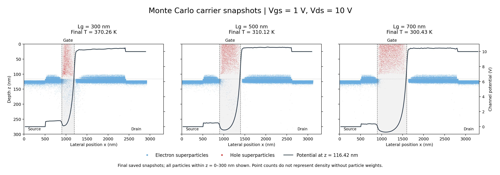</a><figcaption class="figure-caption">파란 점: 전자 슈퍼입자. 빨간 점: 정공 슈퍼입자. 검은 선: z ≈ 116.42 nm에서의 채널 전위(오른쪽 축). 회색 영역과 수직 점선은 gate 위치와 양 끝입니다. 깊이 0–300 nm에 있는 저장 입자를 모두 표시했습니다. 그림을 누르면 확대할 수 있습니다.</figcaption></figure><p><strong>관찰.</strong> Lg가 길어질수록 gate 아래에서 전자 입자가 드문 구간이 길어집니다. 짧은 gate에서는 드레인 쪽 높은 전위로 상승하는 위치가 source에 더 가까워집니다. 전류 그래프의 낮은 gate 전압에서 나타나는 차이를 내부 분포와 함께 살펴볼 자료입니다.</p><p><strong>해석 범위.</strong> 시간 평균이 아닌 최종 순간의 분포입니다. 점의 겹침과 슈퍼입자 가중치 때문에 점의 개수나 진하기를 정량적 밀도로 해석하지 않으며, 입자가 드문 모습만으로 완전한 공핍을 확정하지 않습니다. Self-heating이 적용되어 최종 갱신 온도는 Lg = 300, 500, 700 nm에서 각각 370.26, 310.12, 300.43 K입니다. 파일 내부 계산 날짜는 각각 2026-08-07, 2026-09-16, 2026-08-04입니다. 한 Vds 조건의 비교이므로 DIBL의 정량 추출을 대신하지 않습니다.</p></section></section>
<section id="lsg" style="scroll-margin-top:90px"><h2>3. Source-to-gate distance (Lsg)</h2><p>Lsg = 400, 600, 800 nm. 나머지 구조 치수는 기본값입니다.</p>
<figure class="figure" style="display:block;margin:1.5rem 0"><a href="images/results/lsg-transfer.png">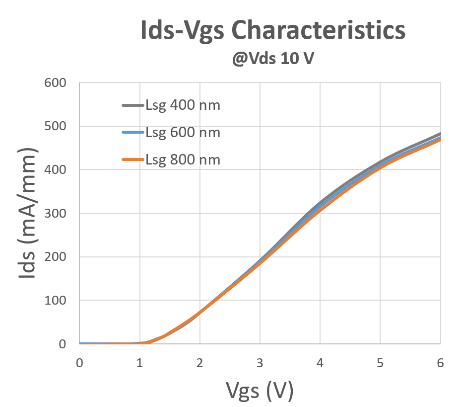</a><figcaption class="figure-caption">Figure 5. Source-to-gate distance (Lsg) — Ids–Vgs, Vds = 10 V.</figcaption></figure>
<figure class="figure" style="display:block;margin:1.5rem 0"><a href="images/results/lsg-output.png">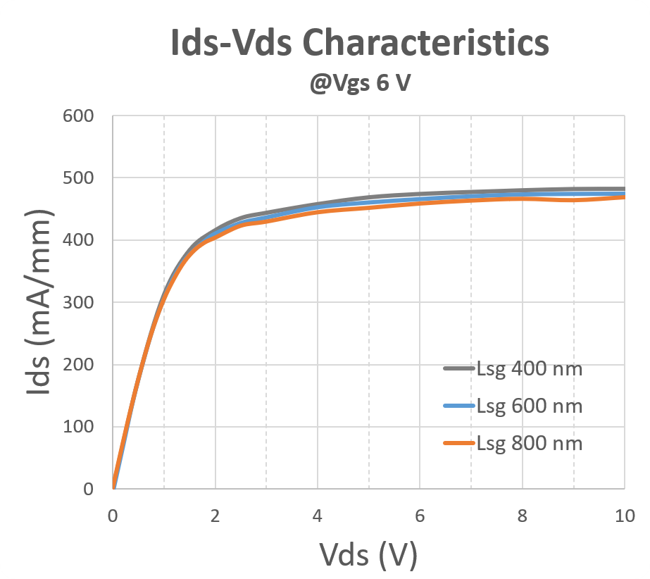</a><figcaption class="figure-caption">Figure 6. Source-to-gate distance (Lsg) — Ids–Vds, Vgs = 6 V.</figcaption></figure><p><strong>관찰 및 해석 범위.</strong> Lsg가 길어질수록 높은 gate 전압에서 전류가 조금 감소하며, turn-on 구간은 거의 겹칩니다. 작은 곡선 차이의 원인은 이후 전위분포와 전류 통계로 보충합니다.</p></section>
<section id="lgd" style="scroll-margin-top:90px"><h2>4. Gate-to-drain distance (Lgd)</h2><p>Lgd = 1225, 3000 nm. 나머지 구조 치수는 기본값입니다.</p>
<figure class="figure" style="display:block;margin:1.5rem 0"><a href="images/results/lgd-transfer.png">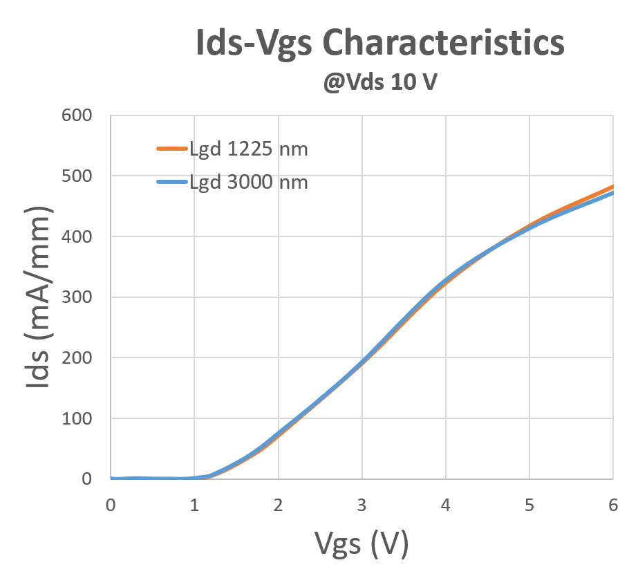</a><figcaption class="figure-caption">Figure 7. Gate-to-drain distance (Lgd) — Ids–Vgs, Vds = 10 V.</figcaption></figure>
<figure class="figure" style="display:block;margin:1.5rem 0"><a href="images/results/lgd-output.png">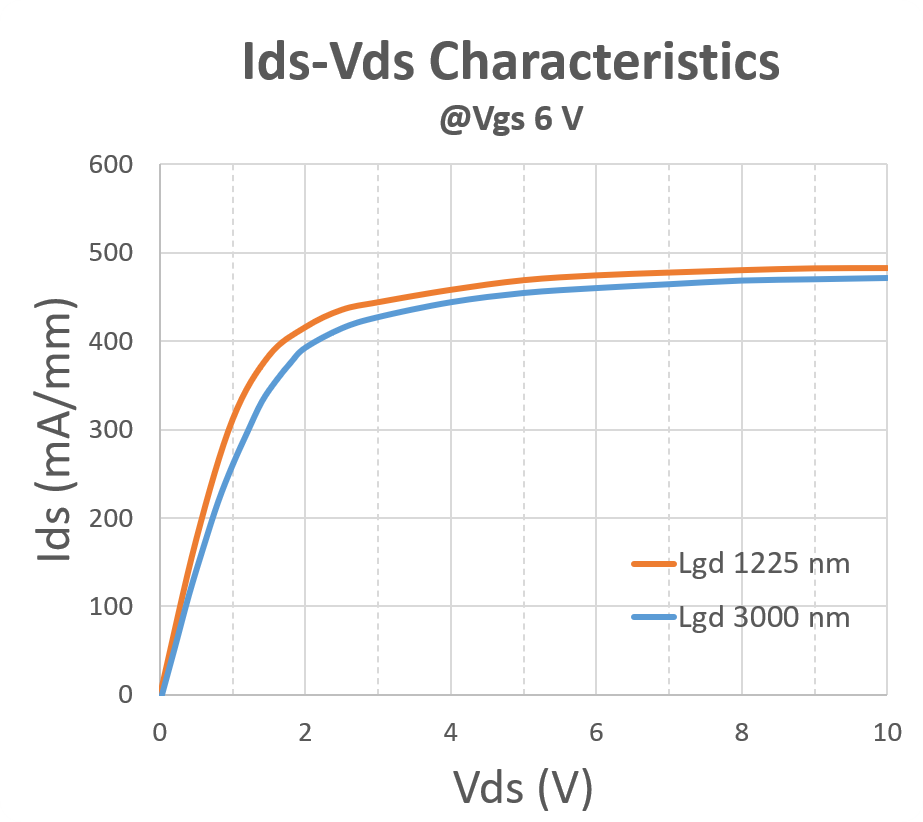</a><figcaption class="figure-caption">Figure 8. Gate-to-drain distance (Lgd) — Ids–Vds, Vgs = 6 V.</figcaption></figure><p><strong>관찰 및 해석 범위.</strong> 출력 특성에서 3000 nm의 전류가 더 낮고, 낮은 Vds에서 차이가 두드러집니다. 전달 특성은 대부분 겹치며 중간 Vgs에서 작은 교차가 있습니다. 전압 강하 및 self-heating의 기여는 추가 자료로 확인합니다.</p></section>
<section id="temperature" style="scroll-margin-top:90px"><h2>5. Substrate temperature</h2><p>Tsub = 300, 350, 400 K. 기본 구조, Rth = 20 K·mm/W, self-heating ON.</p>
<figure class="figure" style="display:block;margin:1.5rem 0"><a href="images/results/temperature-transfer.png">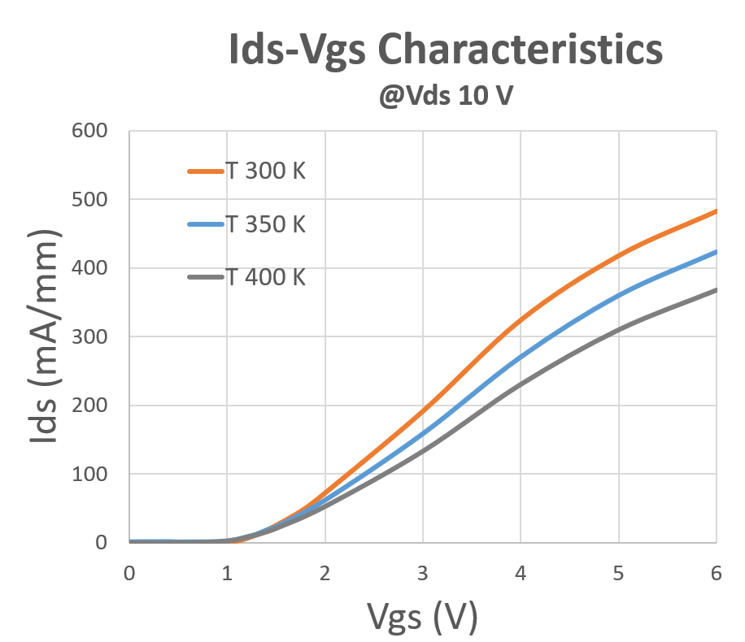</a><figcaption class="figure-caption">Figure 9. Substrate temperature — Ids–Vgs, Vds = 10 V. 범례 T = Tsub, self-heating ON.</figcaption></figure>
<figure class="figure" style="display:block;margin:1.5rem 0"><a href="images/results/temperature-output.png">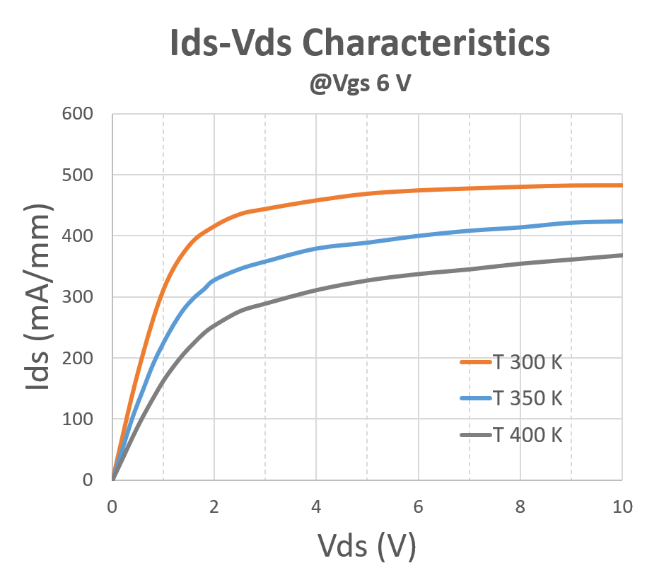</a><figcaption class="figure-caption">Figure 10. Substrate temperature — Ids–Vds, Vgs = 6 V. 범례 T = Tsub, self-heating ON.</figcaption></figure><p><strong>관찰 및 해석 범위.</strong> Tsub가 증가할수록 전달·출력 특성의 전류가 감소합니다. 그림의 T는 substrate temperature를 뜻합니다. Self-heating이 적용되어 실제 모델의 소자 온도는 Tsub와 다르며, 이 결과는 고정 소자 온도에서의 등온 비교가 아닙니다.</p></section>
<section id="rth" style="scroll-margin-top:90px"><h2>6. Thermal resistance</h2><p>Rth = 20, 30, 40 K·mm/W. 기본 구조, Tsub = 300 K, self-heating ON.</p>
<figure class="figure" style="display:block;margin:1.5rem 0"><a href="images/results/rth-transfer.png">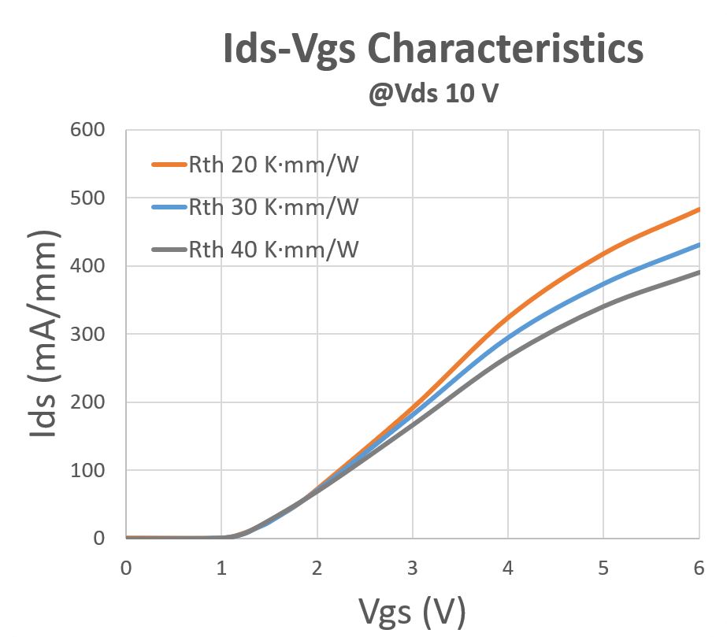</a><figcaption class="figure-caption">Figure 11. Thermal resistance — Ids–Vgs, Vds = 10 V.</figcaption></figure>
<figure class="figure" style="display:block;margin:1.5rem 0"><a href="images/results/rth-output.png">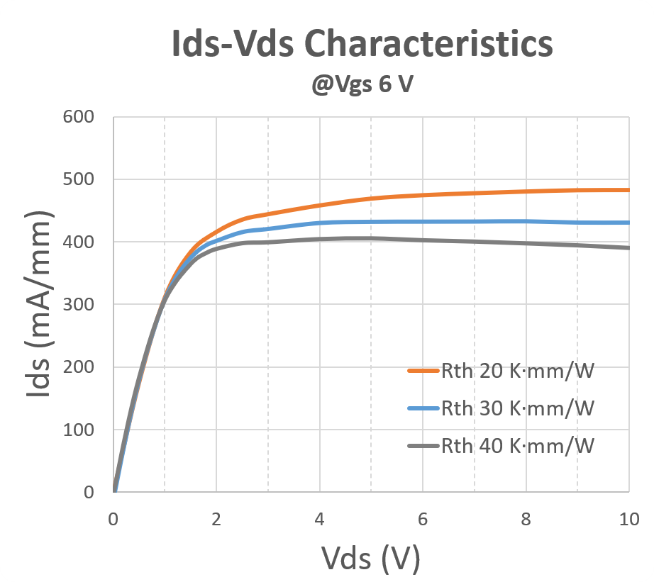</a><figcaption class="figure-caption">Figure 12. Thermal resistance — Ids–Vds, Vgs = 6 V.</figcaption></figure><p><strong>관찰 및 해석 범위.</strong> 낮은 Vds에서 곡선이 거의 겹치지만 높은 Vds에서는 Rth가 클수록 전류가 낮아집니다. Rth = 40 K·mm/W에서는 약 4–5 V 이후 완만한 전류 감소가 보입니다. 온도·전력 기록으로 해석을 보충할 예정입니다.</p></section><section id="next"><h2>추후 보충 자료</h2><p>전류 그래프를 먼저 공개하고, 전위·전기장·carrier 분포와 온도 기록을 각 항목에 순차적으로 추가합니다. 현재 결과는 개발 중인 시뮬레이터의 비교 결과이며, 실험 소자의 정량적 검증을 대신하지 않습니다.</p></section>
```
